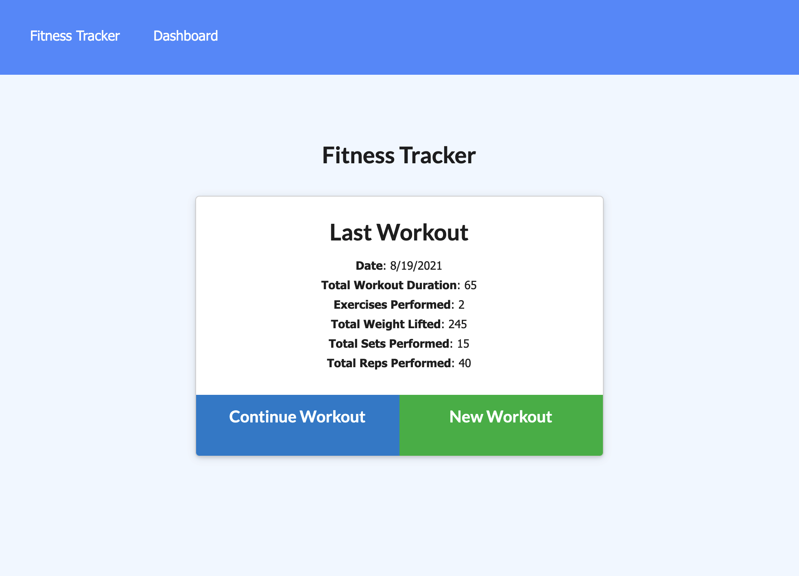
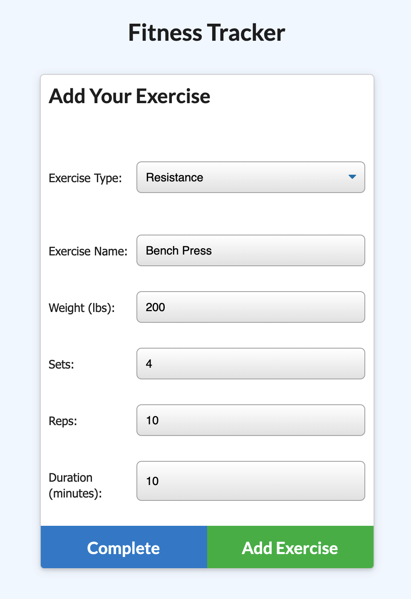
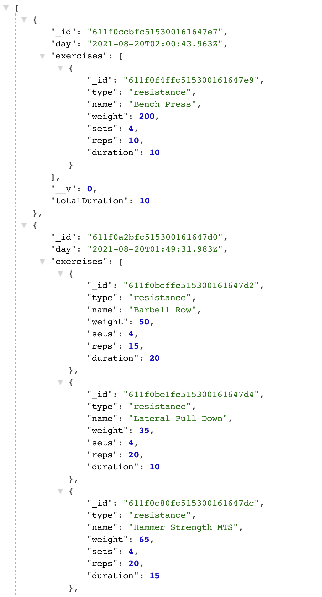
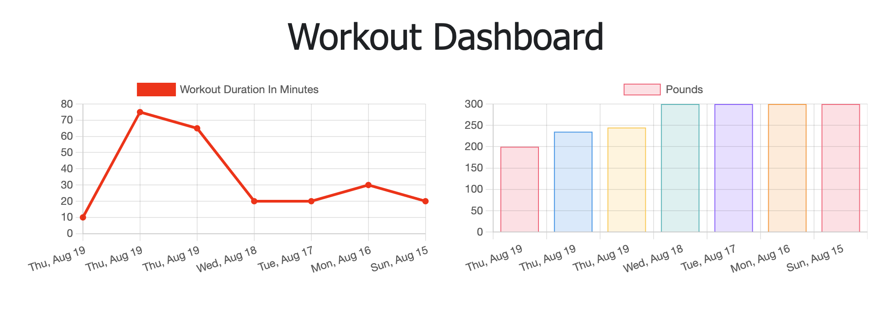

# Fitness-Tracker
Deployed Link: [kc-fitness-tracker.herokuapp.com](kc-fitness-tracker.herokuapp.com)

  [](https://opensource.org/licenses/MIT)

  ## Description
  This project allows users to track their daily workout routines. Users can add many exercises, either resistance or cardio, into their workout plan. This app takes user input and keeps track of the weight, sets, reps, distance, and duration. Especially, this project will provide the total duration of your workout. The data management was done by MongoDB and Mongoose ODM.

  ## Table of Contents
  * [Installation](#installation)
  * [Usage](#usage)
  * [License](#license)
  * [Contributing](#contributing)
  * [Tests](#tests)
  * [Questions](#questions)
 
  ## Installation
  Fork this repo into your GitHub. Make sure the fork process has been completed without any issue by checking all files in your forked repo. Verify whether you have node.js installed on your desktop or not by running the command `node -v` in your terminal. If you do not have node.js installed, please go to [https://coding-boot-camp.github.io/full-stack/nodejs/how-to-install-nodejs](https://coding-boot-camp.github.io/full-stack/nodejs/how-to-install-nodejs) and it will walk you through the process.

  You also need `MongoDB` in order to run this application. If you do not have `MongoDB` installed on your device, then please install.

  Once you completed the installation process, make sure your MongoDB is running. Then, try to run `npm start`, it will probably give you an error BECAUSE the required dependencies are not installed yet into the root directory. Run `npm install` to install required dependencies (check `package.json`). Then, run `npm run seed`. This will seed the data into the database. Finally, run `node server.js`.

  ## Usage
  After you run `node server.js`, go to the browser, and type `localhost:3000`. Then, you will see the following page with the latest workout stats:

  

  There is an option either you can continue with the latest workout or create a new workout routine. The following shows the process of creating a new workout: 

  

  You can add the exercise type and add other input as shown in the image. Once you click the `Add Exercise` button, it will add another exercise within the same workout. If you click the `Complete` button, it will save the workout with the exercises input. 

  Then, you can check the api data by directing the page to `/api/workouts/`. This will show you all workouts you added and the latest workout will show up as shown below:

  
  
  Also, you can go to `dashboard` page, it will show your workout stats and data as shown below. The left graph shows the total duration of your workout for each day. The right graph shows how much weight you lifted that day.

  

  ## License
  This project is covered under MIT License.

  <details>
    <summary>
      See License
    </summary> 
  
  ```
  Copyright <2021> <Kevin Choi>

  Permission is hereby granted, free of charge, to any person obtaining a copy of this software and associated documentation files (the "Software"), to deal in the Software without restriction, including without limitation the rights to use, copy, modify, merge, publish, distribute, sublicense, and/or sell copies of the Software, and to permit persons to whom the Software is furnished to do so, subject to the following conditions:
  The above copyright notice and this permission notice shall be included in all copies or substantial portions of the Software.
  
  THE SOFTWARE IS PROVIDED "AS IS", WITHOUT WARRANTY OF ANY KIND, EXPRESS OR IMPLIED, INCLUDING BUT NOT LIMITED TO THE WARRANTIES OF MERCHANTABILITY, FITNESS FOR A PARTICULAR PURPOSE AND NONINFRINGEMENT. IN NO EVENT SHALL THE AUTHORS OR COPYRIGHT HOLDERS BE LIABLE FOR ANY CLAIM, DAMAGES OR OTHER LIABILITY, WHETHER IN AN ACTION OF CONTRACT, TORT OR OTHERWISE, ARISING FROM, OUT OF OR IN CONNECTION WITH THE SOFTWARE OR THE USE OR OTHER DEALINGS IN THE SOFTWARE.
  ```
  </details>
  

  ## Contributing
  No contribution will be accepted at this moment.

  ## Tests
  There are no tests available in this application.

  ## Questions
  If you have any questions, please contact me via

  * Email: [kevchoi1028@gmail.com](mailto:kevchoi1028@gmail.com)

  * GitHub: [https://github.com/rhwlffk1028](https://github.com/rhwlffk1028)

  * Linkedin: [https://linkedin.com/in/kevchoi](https://linkedin.com/in/kevchoi)
